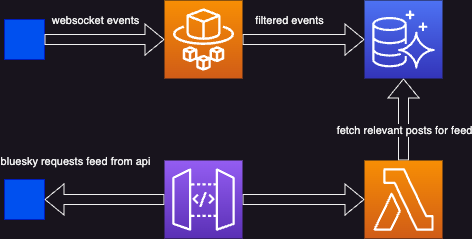

# Bluesky Feed Generator on AWS

This project is based on [feed-generator](https://github.com/bluesky-social/feed-generator) from bluesky.

It is a CDK project that creates:

- A fargate service that parses the Bluesky websocket event stream
- A Serverless Aurora MySQL database that stores posts we care about
- An API Gateway that serves a json file and the feed lambda
- A Lambda function that generates the feed(s)

As part of the CDK deployment, it initializes the database and publishes the feed to bluesky.

## Requirements

You should already have a Bluesky account.  Create an app password in your settings section and store it in a secrets manager secret via the console.  The CDK Stack will need the secret ARN as part of the config.
